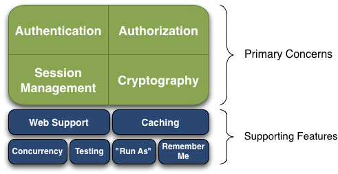

# 1. Introduction 介绍

## 什么是Apache Shiro? 

Apache Shiro是一个功能强大、灵活的，开源的安全框架。它可以干净利落地处理身份验证、授权、企业会话管理和加密。

Apache Shiro的首要目标是易于使用和理解。安全通常很复杂，甚至让人感到很痛苦，但是Shiro却不是这样子的。一个好的安全框架应该屏蔽复杂性，向外暴露简单、直观的API，来简化开发人员实现应用程序安全所花费的时间和精力。

Shiro能做什么呢？

* 验证用户身份
* 用户访问权限控制，比如：
    * 判断用户是否分配了一定的安全角色。
    * 判断用户是否被授予完成某个操作的权限
* 在非 web 或 EJB 容器的环境下可以任意使用Session API
* 可以响应认证、访问控制，或者 Session 生命周期中发生的事件
* 可将一个或以上用户安全数据源数据组合成一个复合的用户 "view"(视图)
* 支持单点登录(SSO)功能
* 支持提供“Remember Me”服务，获取用户关联信息而无需登录
* 等等

这些都集成到一个有凝聚力的易于使用的API。

Shiro 致力在所有应用环境下实现上述功能，小到命令行应用程序，大到企业应用中，而且不需要借助第三方框架、容器、应用服务器等。当然 Shiro 的目的是尽量的融入到这样的应用环境中去，但也可以在它们之外的任何环境下开箱即用。

## Apache Shiro特性

Apache Shiro是一个全面的、蕴含丰富功能的安全框架。下图为描述Shiro功能的框架图：

Authentication（认证）, Authorization（授权）, Session Management（会话管理）, Cryptography（加密）被 Shiro 框架的开发团队称之为应用安全的四大基石。那么就让我们来看看它们吧：

* Authentication（认证）：用户身份识别，通常被称为用户“登录”
* Authorization（授权）：访问控制。比如某个用户是否具有某个操作的使用权限。
* Session Management（会话管理）：特定于用户的会话管理,甚至在非web 或 EJB 应用程序。
* Cryptography（加密）：在对数据源使用加密算法加密的同时，保证易于使用。

还有其他的功能来支持和加强这些不同应用环境下安全领域的关注点。特别是对以下的功能支持：

* Web支持：Shiro 提供的 web 支持 api ，可以很轻松的保护 web 应用程序的安全。
* 缓存：缓存是 Apache Shiro 保证安全操作快速、高效的重要手段。
* 并发：Apache Shiro 支持多线程应用程序的并发特性。
* 测试：支持单元测试和集成测试，确保代码和预想的一样安全。
* "Run As"：这个功能允许用户假设另一个用户的身份(在许可的前提下)。
* "Remember Me"：跨 session 记录用户的身份，只有在强制需要时才需要登录。